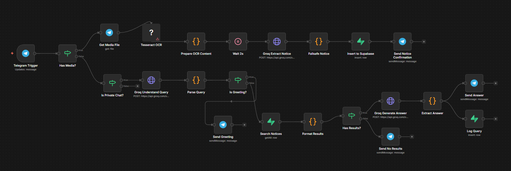

# 🎓 GUB Jiggasha Bot

> **Centralized Notice & Information System for Green University of Bangladesh**


[](https://t.me/GubJiggasha_bot)

> [!NOTE]
> **Data Status:** Currently, the bot contains limited information. Full data and notices for the **Spring 26** semester will be available very soon!

## ⚠️ The Problem

University notices and important public information are currently scattered across various channels:
- 📢 Multiple Facebook Groups
- 📄 Official Facebook Pages
- clubs & community groups

**Pain Point:** Students often miss critical deadlines or lose track of important announcements because the information is decentralized. Finding a specific notice from weeks ago is nearly impossible without asking classmates manually.

## 💡 The Solution

**GUB Jiggasha Bot** is an automated workflow that centralizes all university notices into a searchable, AI-powered system.

1.  **Ingest:** Admin forwards a notice (Image/PDF) to the Telegram Bot.
2.  **Process:** The bot uses **OCR** to read the text and **Google Gemini AI** to extract structured data (Title, Deadline, Department, etc.).
3.  **Store:** Extracted information is stored in a **Supabase** database.
4.  **Serve:** Students can ask the bot questions like *"When is the fee payment deadline?"* and get instant, accurate answers based on the stored notices.

---

## 🛠️ Architecture



The system is built on an **n8n** workflow with the following components:

### 1. Notice Ingestion Flow 📥
*   **Trigger:** Telegram Message (Admin sends image/PDF)
*   **OCR:** Tesseract.js (Extracts raw text from media)
*   **AI Extraction:** **Google Gemini 1.5 Flash** (Converts raw text → Structured JSON)
*   **Database:** Supabase (Inserts cleaned data)
*   **Confirmation:** Telegram (Notifies admin of success)

### 2. Student Query Flow 💬
*   **Trigger:** Telegram Message (Student asks a question)
*   **AI Understanding:** **Google Gemini 1.5 Flash** (Analyzes intent: `fee`, `exam`, `general`, etc.)
*   **Search:** Supabase (Vector/Text search for relevant notices)
*   **AI Response:** **Google Gemini 1.5 Flash** (Generates a friendly "Banglish" response with emojis)
*   **Log:** Supabase (Logs query for analytics)

---

## 🚀 Repository & Setup

**Repository Name:** `gub-jiggasha-bot`

### Prerequisites
*   [n8n](https://n8n.io/) (Self-hosted)
*   [Supabase](https://supabase.com/) Project
*   [Google Gemini API Key](https://aistudio.google.com/)
*   [Telegram Bot Token](https://t.me/BotFather)

### Installation
1.  **Clone the repo:**
    ```bash
    git clone https://github.com/your-username/gub-jiggasha-bot.git
    ```
2.  **Import Workflow:**
    - Open n8n.
    - Go to **Workflows** > **Import**.
    - Select `notice.json` from this repository.
3.  **Configure Credentials:**
    - Set up `Telegram API`, `Supabase API`, and `Gemini API Key` in n8n credentials.

---

## 📊 Database Schema (Supabase)

**Table: `notices`**
| Column | Type | Description |
| :--- | :--- | :--- |
| `id` | uuid | Primary Key |
| `title` | text | Title of the notice |
| `raw_content` | text | Full OCR text |
| `deadline` | date | Extracted deadline |
| `department` | text | Target dept (CSE, EEE, etc.) |
| `created_at` | timestamp | Auto-generated |

**Table: `query_logs`**
| Column | Type | Description |
| :--- | :--- | :--- |
| `user_telegram_id` | text | User ID |
| `user_query` | text | The question asked |
| `detected_intent` | text | AI classified intent |
| `response_text` | text | Bot's reply |

---

## 🤖 AI Models Used
- **OCR:** Tesseract.js (Optical Character Recognition)
- **LLM:** Google Gemini 1.5 Flash


---

## 📝 License
This project is open-source and available under the [MIT License](LICENSE).

---
*Built with ❤️ for GUB Students*